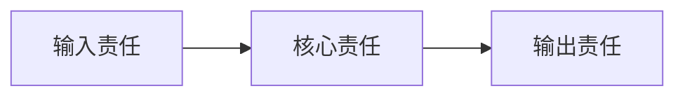

# 项目设计总入口

> 仅在项目需要独立设计入口时使用；存在等价权威时复用并链接。按项目语言改写并删除不适用章节，不创建重复权威。

## 状态与当前结论

- 状态：草案 / 现行 / 已取代 / 其他真实状态
- 当前结论：用一句可验证的话说明目前采用什么，以及哪些仍未确认。
- 适用范围：

## 目的

- 说明本文件帮助读者理解什么，以及详细事实由哪些文档维护。

## 文档导航

> 小项目在此维护完整必要索引；文档较多或受众复杂时，只保留设计入口并链接 `docs/README.md`。

| 文档 | 类型/用途 | 受众 | 状态 | 唯一权威 |
| --- | --- | --- | --- | --- |
|  |  |  |  |  |

## 目标与非目标

### 目标

- （填写）

### 非目标

- （填写）

## 原则

- 每条原则说明一个会约束设计或判断的长期规则。

## 系统关系

当前结论：说明下面这一个关系为什么是理解当前设计所必需的。

边界说明：本图只表达一个主要责任关系；不证明源码、制品、运行态或使用状态。若需要表达另一类关系，另建一张有独立结论和边界说明的图；不把多种语义挤进同一图。

## 关键边界

| 边界 | 归属 | 当前结论 | 唯一权威 |
| --- | --- | --- | --- |
|  |  |  |  |

## 选项与状态（按需保留）

| 选项 | 状态 | 证据或决定入口 |
| --- | --- | --- |
|  | 候选 / 已采用 / 已拒绝 / 未验证 |  |

## 未决事项

- 无 / 写明 `UNKNOWN`、影响、责任位置和关闭证据。

## 更新触发

- 架构、合同、责任、数据、交付边界或关键选项状态变化时更新。
- 里程碑关闭时核对当前结论、索引、未决事项和修订记录是否仍然新鲜。

## 修订记录

| 日期 | 变更 |
| --- | --- |
| YYYY-MM-DD | 初始版本 |
