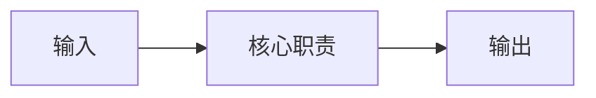

# 项目设计总入口

## 状态

- 状态：
- 当前结论：
- 适用范围：
- 更新触发：

## 目标与非目标

### 目标

- （填写）

### 非目标

- （填写）

## 系统概览

当前采用的系统关系是：

该图只表达主要职责关系，不证明部署或消费者状态。

## 关键边界

| 边界 | 当前结论 | 权威文档 |
| --- | --- | --- |
|  |  |  |

## 详细文档索引

| 文档 | 责任 |
| --- | --- |
|  |  |

## 未决事项

- 无 / 写明 UNKNOWN 和关闭证据。

## 更新触发

- 架构、合同、责任、运行层或消费者边界变化时更新。

## 修订记录

| 日期 | 变更 |
| --- | --- |
| YYYY-MM-DD | 初始版本 |
