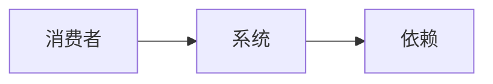
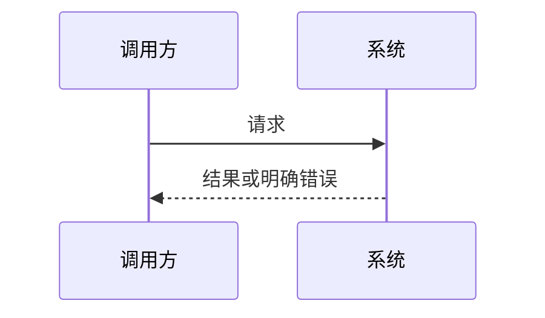
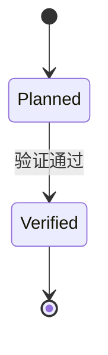

# 系统架构

> 仅在详细架构需要独立共享权威时使用。下面三类关系按需选择，不要机械保留全部章节或 Mermaid。

## 状态

- 状态：
- 当前结论：
- 适用范围：
- 更新触发：

## 系统上下文

系统与外部参与者的主要关系是（存在该关系时保留）：

该图只描述责任关系；运行实例与活动消费者需要独立证据。

## 模块职责

| 模块 | 输入 | 输出 | 不负责 |
| --- | --- | --- | --- |
|  |  |  |  |

## 关键流程

请求按以下顺序跨越模块边界（存在跨模块时序时保留）：

## 生命周期

只在项目实际跟踪独立生命周期时保留：

## 边界与证据

| 声明 | 所需直接证据 | 当前状态 |
| --- | --- | --- |
|  |  | UNKNOWN |

删除不适用的关系、模块、流程或生命周期章节，并在设计入口保留当前唯一权威链接。

## 未决事项

- （填写）

## 更新触发

- 模块、数据流、合同、生命周期或部署拓扑变化时更新。

## 修订记录

| 日期 | 变更 |
| --- | --- |
| YYYY-MM-DD | 初始版本 |
